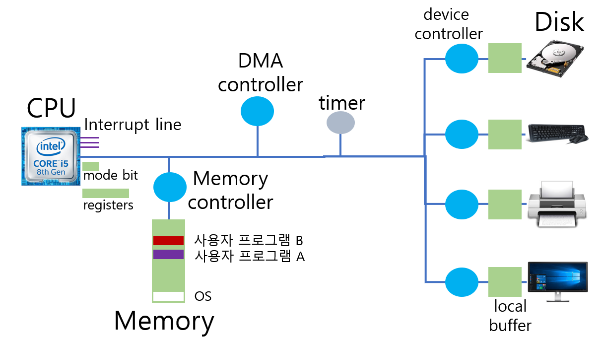
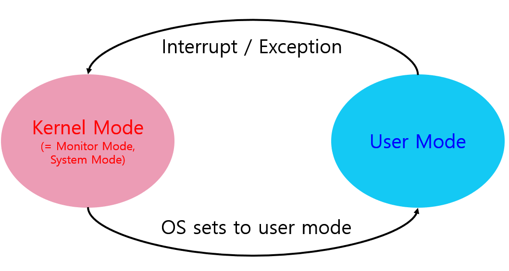
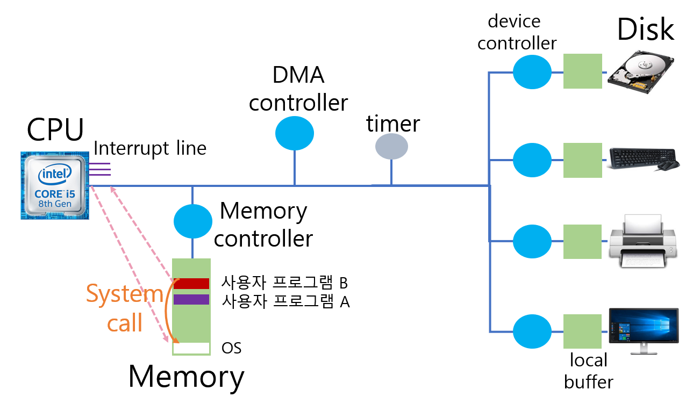

<!--more-->

# 1. 컴퓨터 시스템 구조

- **CPU** : 기계어를 하나씩 읽어서 실행.  
<mark>(매 클럭마다) ① Memory에서 Instruction을 읽고 ② 실행 ( ③ 인터럽트 확인) 을 반복한다.</mark>   
CPU는 IO 디바이스를 직접 접근하지 않고 메모리만 접근하는 Instruction을 실행.  
IO디바이스에서 읽어올 필요가 있을때 본인이 일하는 것이 아니라 **Device Controller**에게 일을 시킨다.  
=> CPU는 다른일 수행한다.   
=> IO는 요청한 데이터를 읽어오고 **Local Buffer**에 저장해둔다.   
=> Local Buffer가 차면 Interrupt 걸어서 CPU에게 알려준다.   
=> 운영체제에게 CPU 넘어간다.   
=> Local Buffer 내용을 읽어오라는 프로그램에게 복사해서 넣어준다.  
 
_cf) CPU는 Memory, Local Buffer 접근이 가능하다._  
_그런데 Interrupt가 너무 자주 일어나면 효율적이지 않으므로 **DMA**를 둔다._

- **Register** : Memory보다 빠르면서 정보를 저장할 수 있는 작은 공간.

- **Mode bit** : CPU에서 실행되고 있는 것이 운영체제인지 사용자 프로그램인지 구분.

- **Interrupt Line** :  Disk에서 읽어오거나 IO가 읽어 왔을때 인터럽트 발생시 알려주는 역할.

- **Memory** : CPU의 작업 공간.

- **DMA**(Direct Memory Access) : <mark>직접 메모리를 접근할 수 있는 Controller</mark>로 Local Buffer 내용을 Memory에 복사해준다. 
일이 전부 끝나면 Interrupt를 한 번걸어서 CPU에게 알려준다.

- **Memory Controller** : CPU와 DMA Controller가 동시에 Memory 접근하면 충돌나므로 이를 중재해주는 역할을 함.

- **Timer** : 하나의 프로그램이 CPU를 독점하는 것을 방지. 
무한루프 같은 것을 방지하기 위해 시간 셋팅하고 CPU넘겨준다.

- **Disk** : Memory로 input 하기도 하고 Memory 내용을 파일로 저장하는 output을 하기도 한다.

- **Device Controller** : IO/Device를 전담하는 작은 CPU.  
Disk에서 헤드가 어떻게 움직이고 어떤 데이터를 읽을지 Disk 내부 통제한다.

- **Local Buffer** : Device Controller의 작업공간.

cf) 사용자 프로그램은 IO 작업이 필요할 시 운영체제에게 요청한다.  
(CPU를 운영체제에게 넘기는 이유 :  보안문제로 사용자 프로그램이 직접 접근 하지 못하게 해뒀기 때문)

# 2. Mode Bit
> 사용자 프로그램의 잘못된 수행으로 다른 프로그램 및 운영체제에 피해가 가지 않도록 하기 위한 보호 장치  
-> 보안을 해칠 수 있는 중요한 명령어는 커널 모드에서만 수행 가능한 '특권명령'으로 규정함.

- **0 커널 모드**(=모니터모드, 시스템모드) : OS 코드 수행
- **1 사용자 모드** : 사용자 프로그램 수행

# 3. Timer
> 하나의 프로그램이 CPU를 독점하는 것으로부터 보호  
-> 정해진 시간이 흐른 뒤 운영체제에게 제어권이 넘어가도록 인터럽트를 발생   
(매클럭마다 1씩 감소하여 0이되면 인터럽트 발생)

# 4. Device Controller
> 해당 I/O 장치 유형을 관리하는 일종의 작은 CPU   
-> I/O가 끝났을 경우 Interrupt를 발생시켜 CPU에게 그 사실을 알린다.   
cf) 제어 정보를 위해 Control Register, Status Register를 가진다.

- Device Driver(장치구동기) : 각 디바이스를 접근 처리하기 위한 SW
- Device Controller(장치제어기) : 각 디바이스를 제어하기 위한 HW

# 5. 입출력(I/O)의 수행
> 모든 입출력 명령은 '특권 명령'으로 운영체제만이 가능하다.   
-> 사용자 프로그램은 I/O는 특권 명령이기 때문에 실행 불가능하다.

Q : 사용자 프로그램은 I/O를 어떻게 사용하는가?  
A : **System Call**을 사용한다.   
( System Call : 운영체제에게 I/O 요청을 하는 운영체제 함수를 호출하는 것 )

cf) Interrupt Line 설정후 OS에게 CPU가 넘어간다.  
<mark>->이를 sw 인터럽트라고 하며 **Trap**이라고도 부른다.</mark> 

<mark>->일반적으로 **Interrupt**는 HW가 거는 것을 의미한다.</mark>

# 6. 인터럽트(Interrupt)
> 인터럽트 당한 시점의 레지스터와 Program Counter를 save한 후 CPU의 제어를 인터럽트 처리 루틴에 넘긴다.

- **Interreupt**(하드웨어 인터럽트) : 하드웨어가 발생시킨 인터럽트
- **Trap**(소프트웨어 인터럽트)
  - **Exception** : 프로그램이 오류를 범한 경우
  - **System call** : 프로그램이 커널 함수를 호출하는 경우

=> 넓은 의미로 전부 Interrupt라고 부른다.   
(IO를 위한 인터럽트는 SW 인터럽트, HW 인터럽트 모두 사용한다고 보면 된다.)

- 인터럽트 관련 용어
  - **인터럽트 벡터** : 해당 인터럽트의 처리 루틴 주소를 가지고 있음.     
  (처리해야할 함수들의 주소를 정리해둔 테이블)
  - **인터럽트 처리 루틴** : 해당 인터럽트를 처리하는 커널 함수.  
  (각 인터럽트마다 처리해야할 코드)

정리)   
사용자 프로그램 IO 작업이 필요!   
=> Interrupt Line을 셋팅하여 OS 에게 CPU를 넘겨줌.   
=> OS가 IO 작업 요청.  
=> CPU는 다른 작업을 실행.   
=> HW가 IO 작업완료되었음을 Interrupt를 통해 CPU에게 알려줌.   
=> CPU가 사용자 프로그램에 데이터를 전달해줌.

# 7. 시스템콜(System Call)
> 사용자 프로그램이 운영체제의 서비스를 받기 위해 커널 함수를 호출 하는 것

과정)   
=> 사용자프로그램 System Call!!!!   
=> Interrupt Line 설정  
=> OS에게 CPU를 넘김  
