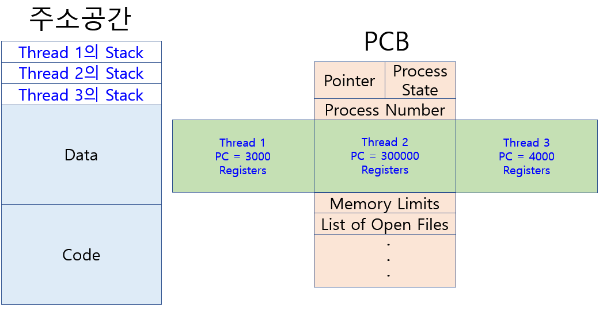

<!--more-->

# Thread란?
> Thread는 Process 내부에 CPU 수행단위가 여러개 있는 것.

**프로세스** 하나가 생성되면,        
**Stack,Data,Code 으로 구성된 주소공간이 프로세스마다 만들어진다.**     
=> 이 프로세스들을 관리하기 위해 운영체제 내부에 **PCB**를 두고 있다.      

동일한 일을 하는 프로세스가 여러개가 있다고 하면 프로세스마다
메모리 주소공간이 여러개가 만들어진다.  => 메모리 낭비...

같은일을 하는 프로세스를 여러개 띄워두고 싶다.      
->메모리 공간 하나만 띄워 두고 프로세스마다 다른 부분의 코드를 실행할 수 있도록 하는 것이 필요.     
=> **쓰레드**의 개념임.     

<mark>프로세스는 하나만 띄워두고 수행단위를 여러개 두고 있는 것이 쓰레드다.</mark>      
(Program Counter만 여러개 : 현재 어디실행하고 있는 지 알기 위해)        

\* 정리  )       
프로세스 하나에서 공유할 수 있는 건 최대한 공유한다.        
- 공유 : 메모리 주소공간, 프로세스 상태, 프로세스가 사용하는 자원들
- 별도 : <mark>PC, Registers, Stack은 Thread별로 별도로 가지고 있다.</mark>  

\- 장점 :   
① 다중 쓰레드로 구성된 태스크 구조에서는 하나의 서버 쓰레드가 blocked(waiting) 상태인 동안에도 동일한 태스크 내의 다른 쓰레드가 실행(running) 되어 빠른 처리를 할 수 있다.

② 동일한 일을 수행하는 다중 쓰레드가 협력하여 높은 처리(throughput)와 성능 향상을 얻을 수 있다.

③ 쓰레드를 사용하면 병렬성을 높일 수 있다.
