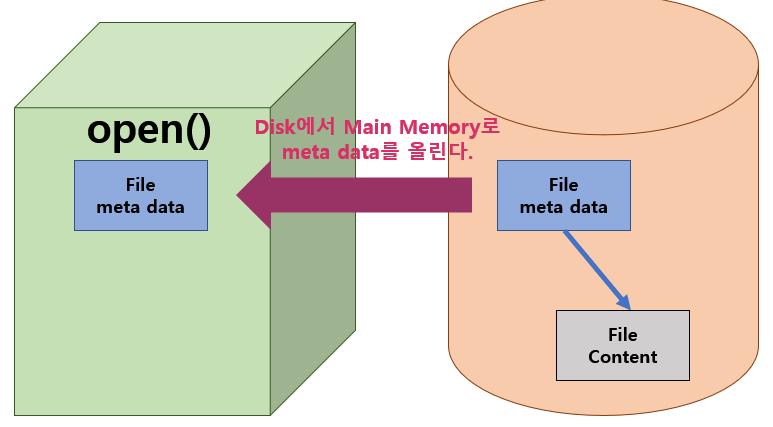
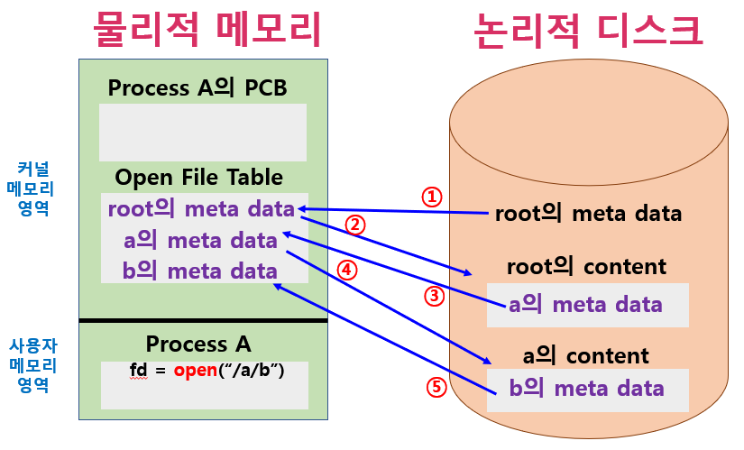
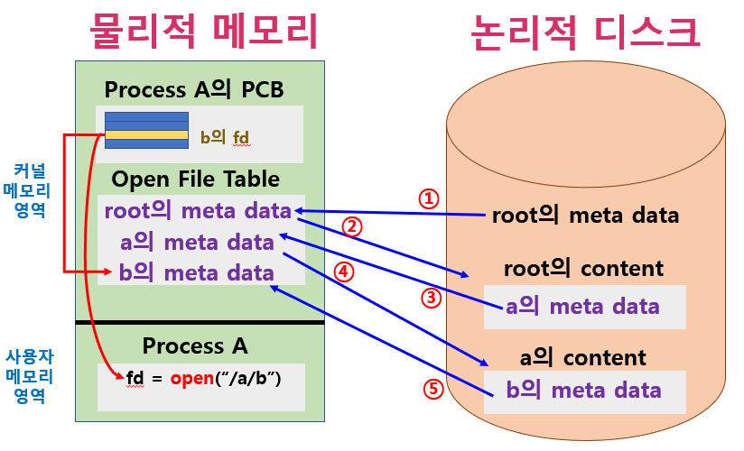
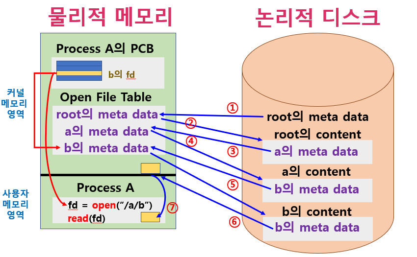
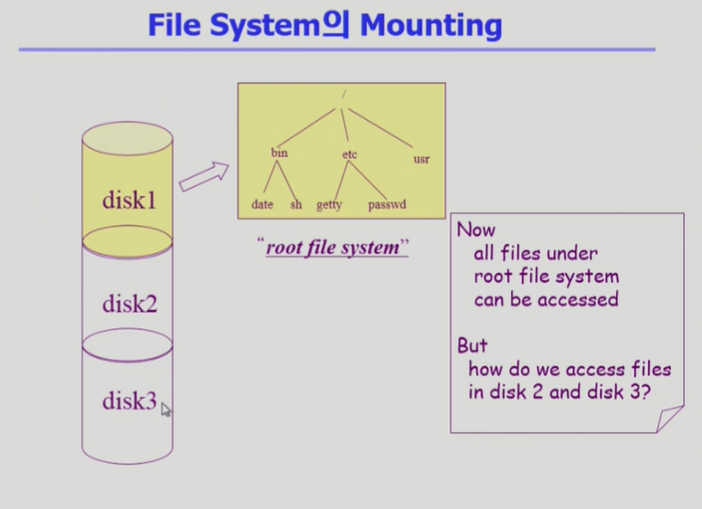
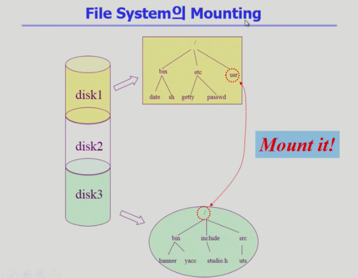

<!--more-->

# 1. File and File System
- File
  - "A named collection of related information"
  - 일반적으로 비휘발성의 보조기억장치에 저장
  - **운영체제는 다양한 저장 장치를 File이라는 동일한 논리적 단위로 볼 수 있게 해줌**
  - Operation
    - create, read, write, reposition(lseek), delete, open, close 등
- **File Attribute(혹은 파일의 meta data)**
  - 파일 자체의 내용이 아니라 파일을 관리하기 위한 각종 정보들
    - 파일 이름, 유형, 저장된 위치, 파일 사이즈
    - 접근 권한(읽기/쓰기/실행), 시간(생성/변경/사용), 소유자 등
- **File System**
  - 운영체제에서 파일을 관리하는 부분
  - 파일 및 파일의 메타데이터, 디렉토리 정보 등을 관리
  - 파일 보호 등

\* **Memory는 주소를 통해 접근하는 단위**   
\* **File은 이름을 통해 접근하는 단위**   
=> ***파일은 데이터를 저장하는 용도로만 쓰는 것이 아니라***   
***장치들도 관리하기 위해 파일이라는 이름을 사용하여 관리하기도 한다.***    

\* **Operation**
- create : 파일 생성
- delete : 파일 삭제
- read / write : 파일 읽고 쓰기
- reposition( = lseek) : 파일을 읽으면 포인터로 위치가 표시 => 다른 부분부터 읽거나 쓰고 싶을때 현재 접근하는 위치를 수정하고 싶을때 사용하는 연산
- open : read / write 하기 전에 open을 해야한다.    
( 파일의 메타데이터를 메모리에 올리는 작업 )
- close : 다 쓰고 나면 close해야한다.  

# 2. Directory and Logical Disk
- **Directory**
  - **파일의 메타데이터 중 일부를 보관하고 있는 일종의 특별한 파일**
  - 그 디렉토리에 속한 파일 이름 및 파일 Attribute 들
  - Operation
    - Search for a file, Create a file, Delete a file
    - List a directory, Rename a file 등
- **Partition (= Logical Disk)**
  - 하나의 (물리적)디스크 안에 여러 파티션을 두는 것이 일반적
  - 여러 개의 물리적 디스크를 하나의 파티션으로 구성하기도 함
  - (물리적) 디스크를 파티션으로 구성한 뒤 각각의 파티션에 **File System**을 깔거나 **Swapping** 등 다른 용도로 사용할 수 있음

# 3. File Operation
## 1) open()
> 파일의 meta data를 메모리에 올려놓는 것

    

\* open("/a/b/c/") 
- 디스크로부터 파일 c의 메타 데이터를 메모리로 가지고 옴
- 이를 위하여 Directory Path를 Search
  - 루트 디렉토리 "/"를 open하고 그 안에서 파일 "a"의 위치 획득
  - 파일 "a"를 open한 후 read하여 그 안에서 파일 "b"의 위치 획득
  - 파일 "b"를 open한 후 read하여 그 안에서 파일 "c"의 위치 획득
  - 파일 "c"를 open한다
- Directory Path의 Search에 너무 많은 시간 소요
  - open을 read / write 와 별도로 두는 이유임
  - 한번 open한 파일은 read / write 시 Directory Search 불필요
- **Open File Table**
  - 현재 open 된 파일들의 메타 데이터 보관소(in memory)
  - 디스크의 메타데이터보다 몇 가지 정보가 추가
    - Open한 프로세스의 수
    - File Offset : 파일 어느 위치 접근 중인지 표시(별도 테이블 필요)
- **File Descriptor**( File Handler, File Control Block)
  - Open File Table에 대한 위치 정보(프로세스 별)

    

사용자 프로그램인 Process A가 a아래 b라는 파일을 open   
=> I/O를 하는 시스템 콜 (운영체제에게 CPU가 넘어간다)   
=> 운영체제에게는 각 프로그램별 관리하기 위한 자료구조가 있고 전체 프로그램이 open한 파일들이 무엇인지 관리하는 Global Table을 가지고 있다.

\* open 동작 순서   
① open을 하면 root 디렉토리의 meta data를 먼저 메모리에 올린다.   
=> root를 먼저 open한다.   
② meta data 안에는 그 파일의 위치정보가 들어있다.   
=> root 디렉토리 실제 내용의 위치를 알 수 있다.    
③ 그 디렉토리 밑에 있는 파일들의 meta data를 가지고 있다.   
a meta data를 메모리에 올린다.    
④ a의 위치로 가면 그 밑에 있는 파일들의 meta data(b)를 알 수 있다.   
⑤ b의 meta data를 메모리에 올린다.   

      
open이 끝나면 시스템 콜의 결과 값을 리턴한다.   
각 프로세스마다 그 프로세스가 open한 파일들에 대한 meta data 포인터를 갖고 있는 배열이 정의 되어 있다. 인덱스 번호 => File Descriptor 반환   

    
read 함수 사용시 File Discriptor를 넘겨주면 테이블의 인덱스 번호를 통해 b의 위치로 가게 되고 그곳에서 읽어서 운영체제에 copy한 후 (⑥) 사용자 프로그램에게 넘겨준다. (⑦)   
어떤 프로그램이 동일한 파일의 동일한 위치를 요청하면 Disk까지 가지 않고 운영체제가 읽어온 내용을 바로 전달 해준다.    
( = Buffer Caching )

**per-process File Descriptor Table** : 프로세스마다 가지고 있다.    
(PCB안에 있는 자료구조에 해당)
**system-wide Open File Table** : open file에 대한 목록들은 시스템 전체 하나만 존재   
(Open File Table에 해당)    

# 4. File의 접근 권한 
> 각 파일에 대해 누구에게 어떤 유형의 접근(read/wirte/execution)을 허락할 것인가?

\* Access Control 방법    
- Access Control Matrix : 행렬로 접근 권한 표시   
단점 : 희소행렬이 크게 되므로 메모리 낭비   
해결 : Linkedlist로 만든다    
   
  - Access Control List : 파일별로 누구에게 어떤 접근 권한이 있는지 표시
  - Capability : 사용자별로 자신이 접근 권한을 가진 파일 및 해당 권한 표시
- Grouping
  - 전체 user를 owner, group, public의 세 그룹으로 구분
  - 각 파일에 대해 세 그룹의 접근권한(rwx)을 3비트씩으로 표시
- Password
  - 파일마다 passwor를 두는 방법(디렉토리 파일에 두는 방법도 가능)
  - 모든 접근 권한에 대해 하나의 password: all-or-nothing
  - 접근 권한별 password : 암기문제, 관리문제

=> 메모리는 프로세스마다 별도로 가지고 있었지만 파일은 여러 사용자가 같이 사용하므로 접근 권한 있는가 접근 연산이 어떤게 가능한가 둘다 가지고 있어야한다.   

# 5. Mounting
> 서로 다른 파일시스템에 접근할 수 있게 해준다.

   
하나의 물리적 디스크를 파티셔닝으로 여러개의 논리적 디스크로 나눌 수 있다.    
각각의 논리적 디스크는 파일시스템을 설치해서 사용할 수 있다.    
=> **다른 파티션에 설치되어 있는 파일시스템을 접근하려면 어떻게 해야하나?**

    

**Mounting** : 루트파일 시스템의 특정 디렉토리 이름에다가 다른 파티션에 있는 파일시스템을 Mount 해주고 Mount된 디렉토리에 접근하면 다른 파일시스템의 루트 디렉토리에 접근하는 꼴이 된다.

# 6. 파일을 접근하는 방법
1. **순차 접근(Sequential Access)**
  - **하나를 보고 나서 중간에 건너 뛸 수 없다.**
  - 카세트 테이프를 사용하는 방식처럼 접근
  - 읽거나 쓰면 offset은 자동적으로 증가
2. **직접 접근(Direct Access, Random Access)**
  - **바로 원하는 곳으로 건너 뛸 수 있다.**
  - LP 레코드 판과 같이 접근하도록 함
  - 파일을 구성하는 레코드를 임의의 순서로 접근할 수 있음

=> 직접 접근의 가능한 경우라도    
데이터를 어떻게 관리하느냐에 따라 순차접근만 허용하는 경우도 있다.