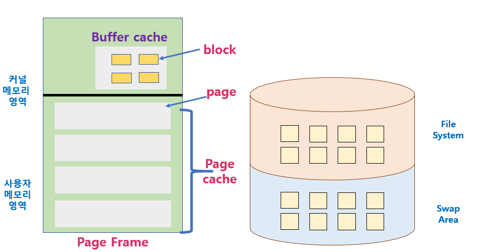
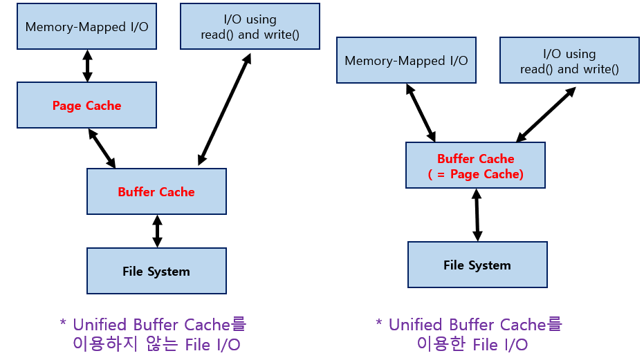
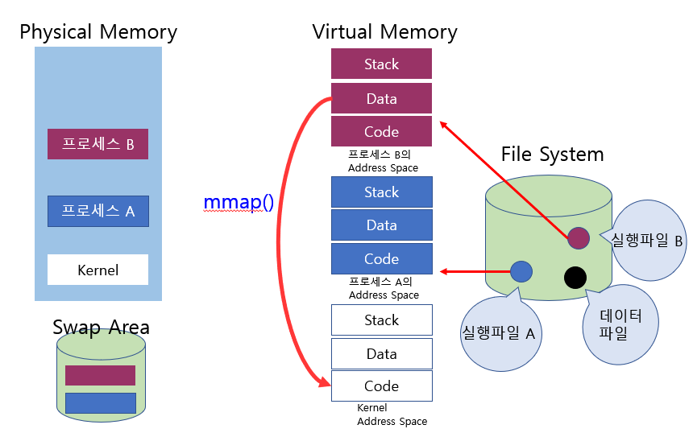
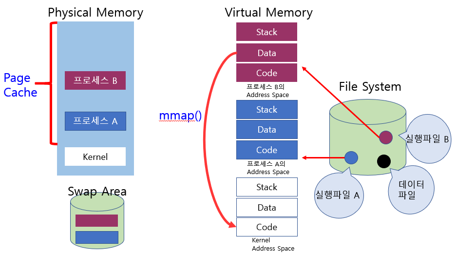
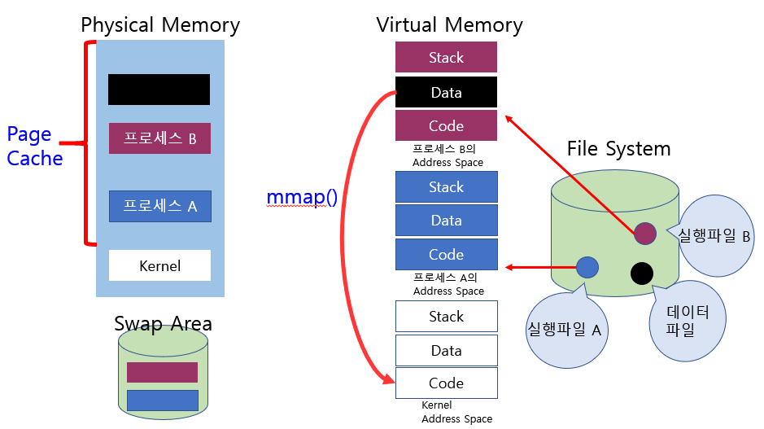
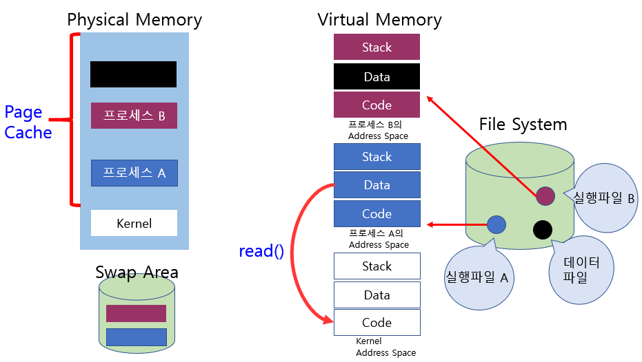
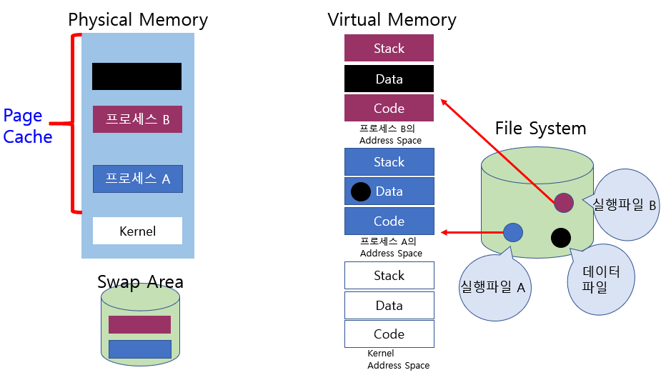

<!--more-->
   
# 1. Page Cache와 Buffer Cache
  

# 1) Page Cache
Page Frame에다가 당장 필요한 내용을 메모리에 올려두고 필요하지 않은 내용들을 쫓아낸다. (= **Page Cache**)   

=> 프로세스 주소 공간을 구성하는 Page가 Swap Area에 내려가 있는가?    
Page Cache에 올라와 있는가? 를 처리하는 문제     
( 단위는 Page로 4kbyte )

# 2) Buffer Cache
프로그램이 파일 입출력이 필요한 경우가 있는데, read System Call 같은걸 하게 되면 디스크에 있는 파일 시스템에서 운영체제가 대신 파일의 내용을 읽어와서 자신의 메모리 영역에 카피해두고 사용자 프로그램에게 전달해준다. (= **Buffer Cache**)    

=> 다음에 동일한 파일에 대한 read/write에 대한 시스템 콜이 오면 디스크에서 읽어 오는게 아니라 buffer cache에 저장된 내용을 전달 해준다.   

=> 파일 데이터가 파일 시스템 Storage에 저장되어 있느냐?   
운영체제 Buffer Cache에 올라와 있는가? 를 처리하는 문제     
( 단위는 Disk에서 어떤 파일의 블록을 읽어와라   

=> 블록은 논리적인 블록 디스크에서는 섹터를 의미    
예전에 섹터는 512byte이었으나 최근에는 Buffer Cache와 Page Cache와 통일 되어서 page 단위를 씀. = **Unified Buffer Cache** )

# 3) Memory Mapped I/O
프로세스의 주소공간의 일부를 파일에 매핑 해둔다.    
맵핑 이후에는 메모리 접근하는 연산을 이용해서 파일 입출력을 할 수 있게 해준다.    

# 2. File I/O
    

## 1) 기존의 파일 읽고 쓰는 방법
> 2가지 인터페이스가 존재.

**① 파일을 open한 후 read, write 시스템 콜을 한다.**    
1. 시스템 콜이므로 운영체제가 해당하는 파일의 내용이 Buffer Cache에 있는 지 확인. 
2. 있으면 그대로 전달해주고 없으면 디스크에서 읽어서 전달해준다.   
사용자 프로그램은 자신의 주소 영역중에 있는 Page에다가 Buffer Cache 내용을 카피해서 사용    

**② Memory Mapped I/O**   
1. 처음에는 운영체제에게 'Memory Mapped I/O 쓰겠다'라는 **mmap 시스템 콜을 호출**.   
2. 자신의 주소공간 중 일부를 파일에다가 맵핑한다. 
( = 디스크에서 Buffer Cache로 읽어오는 것은 동일하다.)    
3. 읽어온 내용을 Page Cache에다가 카피한다.
( Page에 파일에 Mapped된 내용이 들어감. 맵핑 이후는 운영체제의 간섭없이 내 메모리 영역에다가 데이터를 읽거나 쓰는 방식으로 파일입출력이 가능하다. )   
4. 만약 매핑만 해두고 메모리로 안읽어왔다면 **Page Fault**가 발생한다.   

### * 1, 2번 방식의 차이점
진행 방식은 동일하나 1번 방식은 Buffer Cache에 있던 없던 운영체제에게 요청을 해서 받아와야하지만 2번의 경우는 일단 Page Cache에 있다면 운영체제에게 도움을 받지 않고 I/O가 가능하다.

### * Memory Mapped I/O를 사용하는 이유
이미 메모리에 올라온 내용에 대해서는 운영체제를 호출하지 않고 자신의 메모리에 접근하듯이 읽고 쓸 수 있다.   
=>결론적으로 기존의 방식은 두가지 인터페이스 어떤 것을 쓰던지 파일 입출력을 할 경우는 Buffer Cache를 통해야한다.    
따라서 Buffer Cache의 내용을 자신의 Page Cache에 복제해야하는 오버 헤드가 있다.

## 2) Unified Buffer Cache 사용한 파일 읽고 쓰는 방법
> 운영체제가 공간을 따로 나누어놓지 않고 필요에 따라서 Page Cache에 공간을 할당해서 쓴다.

**① 파일을 open한 후 read, write 시스템 콜을 한다.**    
=> 해당하는 내용이 Disk File System에 있던 Buffer Cache(=Page Cache)에 있던 상관없이 운영체제에게 CPU 제어권이 넘어간다. 위와 동일    

**② Memory Mapped I/O**     
=> 처음에 운영체제에게 자신의 주소 영역중 일부를 파일에 매핑하는 단계를 거치고 나면 사용자 프로그램 주소 영역에 Page Cache가 매핑 된다. Buffer Cache가 별도로 존재하지 않고 Page Cache에다가 읽고 쓸 수 있다.   

# 3. 프로그램의 실행
    

1. **프로그램**이 파일 시스템의 실행파일 형태로 저장되어 있다가 **실행시키면 프로세스**가 된다.
2. **프로세스**가 되면 그 프로세스만의 독자적인 주소공간인 **Virtual Memory라는 것이 만들어진다.**
3. **주소변환**을 해주는 하드웨어에 의해서 당장 필요한 부분은 **물리적 메모리에 올라가게 된다.**
4. **물리적 메모리**는 공간이 한정되어 있으므로 쫓겨나는 것들은 Disk의 **Swap Area**로 넘어간다.

cf)   
1. **Memory Mapped I/O**를 쓰는 대표적인 방법이 실행파일에 해당하는 **Code** 부분이다.   
Code 영역 부분은 별도의 Swap Area 영역을 가지고 있지 않고 파일 시스템에 파일로 존재하는 내용이 그대로 프로세스 주소영역에 매핑이 되어있다.    
만약, 이프로그램이 특정 Code에 접근하는데 메모리에 안올라와 있다면 Swap Area에서 올리는 것이 아니라 파일에서 올려 써야한다.   
(***Code 영억 부분은 메모리에 올라간 다음 쫓겨날 때 Swap Area로 내려가지 않는다.***   
***read only라서 File System에 저장되어 있기 때문이다.***)    

2. 실행파일도 파일시스템에 저장되어 있지만 데이터 파일도 저장되어있다.   
프로그램이 실행되다가 자신의 메모리 접근만 하는 것이 아니라 파일의 내용을 읽어오라는
read 시스템 콜을 할 수 있고, Memory Mapped I/O를 쓸 수 도 있다.   

## 1) Memory Mapped I/O 사용시
    

데이터 파일을 읽을때 read 시스템 콜이 아니라 Memory Mapped I/O를 쓰고 싶다면,   
mmap 시스템 콜을 이용하여 '데이터 파일의 일부를 자신의 주소공간 일부에 매핑해주세요' 
라고 운영체제 요청 해야한다.

    

   

1. 운영체제가 데이터 파일의 일부를 Virtual Memory 주소공간 일부에다가 매핑을 해준다.
2. 프로그램이 실행되면서 이 메모리 위치를 접근했을 때 메모리에 안올라와있으면 Page Fault를 일으킨다.
3. 그러면 운영체제가 Page Fault가 일어난 Page를 물리적 메모리에 올려준다.
4. 그 이후는 가상 메모리 Page가 물리적 메모리의 Page와 Mapping이 되어 접근할때는 운영체제 도움을 받지 않아도 된다.    
( 운영체제 도움없이 물리적 메모리에 읽거나 쓰거나 하게 됨 )
5. 메모리에 쫓겨날 때는 Swap Area에 쫓겨나는 게 아니라 File System에 수정된 내용을 써주고 메모리에서 쫓아낸다.    

\* 단점 : 여러 프로세스가 같이 공유하게 되면 일관성을 주의 해야한다.

## 2) read/write 시스템 콜 이용시
   

  

1. read 시스템콜로 파일 요청
2. 운영체제는 자신의 Buffer Cache에 내용을 읽어온다.
3. Unified Buffer Cache는 요청한 데이터 파일의 내용이 이미 Buffer Cache에 올라와 있다면
그 내용을 카피해서 사용자 프로세스에게 전달한다.